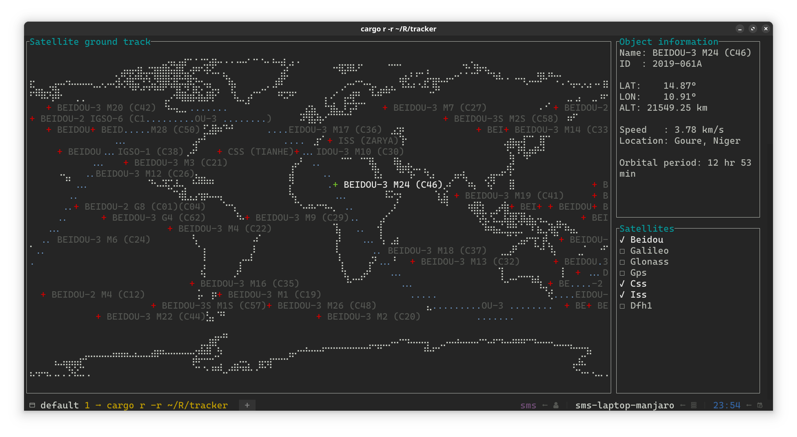

# tracker

A terminal-based real-time satellite tracking and orbit prediction application.

<p align="center">
    <br/>
    <small><i>The font used in the screenshot is <a href="https://github.com/microsoft/cascadia-code">Cascadia Code NF</a>.</i></small>
</p>

## Features

- **Position and trajectory**: Displays the current positions and trajectories of objects using the SGP4 model.
- **Detailed information**: Provides comprehensive details about the selected object.
- **Automatic updates**: Updates orbital elements automatically via the internet.

## Installation

### Package manager

#### Arch Linux

`tracker` is available in the [AUR](https://aur.archlinux.org/packages/tracker/):

```bash
paru -S tracker # use your favorite AUR helper
```

#### Windows

```powershell
scoop bucket add extra
scoop install tracker
```

### Build from source

```bash
cargo install --git https://github.com/ShenMian/tracker
```

## Usage

For detailed instructions on how to use `tracker`, please see our [User Guide](docs/user-guide.md).

## License

Licensed under [Apache License, Version 2.0](LICENSE).
