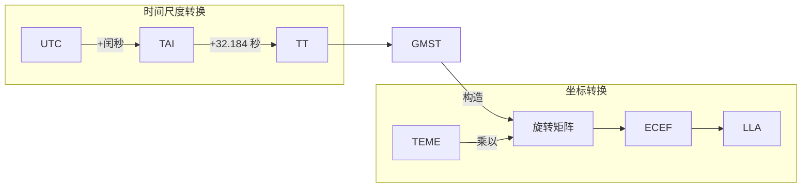

# TEME to LLA

## 流程

1. UTC -> TAI

    $$
    \begin{aligned}
        \text{UTC} - \text{TAI} = -37 \text{s} \\
        \text{TAI} = \text{UTC} + 37 \text{s} \\
    \end{aligned}
    $$

    这一步消除了闰秒带来的误差影响.  
    数据来源于 [Bulletin C 69] (截至 2025 年).

2. TAI -> TT

    $\text{TT} = \text{TAI} + 32.184$

    这一步转换为天体力学 (如轨道传播) 常用的时间尺度.

[Bulletin C 69]: https://datacenter.iers.org/data/html/bulletinc-069.html

## 术语表

| 缩写 | 中文               | 英文                          |
|------|------------------|-------------------------------|
| TEME | 真赤道平春分坐标系 | True Equator Mean Equinox     |
| ECEF | 地心地固坐标系     | Earth Centered Earth Fixed    |
| LLA  | 大地坐标/经纬高    | Latitude, Longitude, Altitude |
| UTC  | 协调世界时         | Coordinated Universal Time    |
| TAI  | 国际原子时         | International Atomic Time     |
| TT   | 地球时             | Terrestrial Time              |
| GMST | 格林尼治平恒星时   | Greenwich Mean Sidereal Time  |
